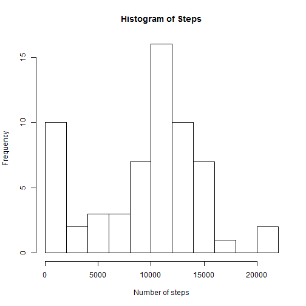
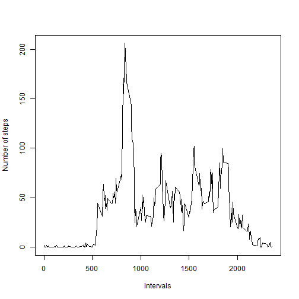
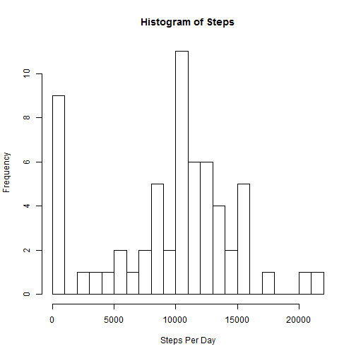
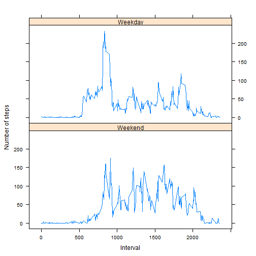

## Loading libraries

```r
library(plyr)
library(timeDate)
library(lattice)
```


## Loading and preprocessing the data

```r
activity = read.csv("activity.csv")
str(activity)
```

```
## 'data.frame':	17568 obs. of  3 variables:
##  $ steps   : int  NA NA NA NA NA NA NA NA NA NA ...
##  $ date    : Factor w/ 61 levels "2012-10-01","2012-10-02",..: 1 1 1 1 1 1 1 1 1 1 ...
##  $ interval: int  0 5 10 15 20 25 30 35 40 45 ...
```

```r
summary(activity)
```

```
##      steps                date          interval     
##  Min.   :  0.00   2012-10-01:  288   Min.   :   0.0  
##  1st Qu.:  0.00   2012-10-02:  288   1st Qu.: 588.8  
##  Median :  0.00   2012-10-03:  288   Median :1177.5  
##  Mean   : 37.38   2012-10-04:  288   Mean   :1177.5  
##  3rd Qu.: 12.00   2012-10-05:  288   3rd Qu.:1766.2  
##  Max.   :806.00   2012-10-06:  288   Max.   :2355.0  
##  NA's   :2304     (Other)   :15840
```


## What is mean total number of steps taken per day?
### Calculate the total number of steps taken per day

```r
dateDat = ddply(activity, "date", summarise, sum=sum(steps, na.rm=T), mean=mean(steps, na.rm=T))
```
### Make a histogram of the total number of steps taken each day

```r
hist(dateDat$sum, breaks=15, xlab="Number of steps", main="Histogram of Steps")
```

 

### Mean and Median of the total number of steps taken per day

```r
mean(dateDat$sum, na.rm=T)
```

```
## [1] 9354.23
```

```r
median(dateDat$sum, na.rm=T)
```

```
## [1] 10395
```


## What is the average daily activity pattern?
### Make a time series plot

```r
intDat = ddply(activity, "interval", summarise, sum=sum(steps, na.rm=T), mean=mean(steps, na.rm=T))
plot(intDat$interval, intDat$mean, 
     type = "l", 
     xlab="Intervals", 
     ylab="Number of steps")
```

 

### 5-minute interval with maximum number of steps

```r
intDat$interval[which.max(intDat$mean)]
```

```
## [1] 835
```

## Imputing missing values
### Total number of rows with NAs

```r
nrow(activity) - nrow(na.omit(activity))
```

```
## [1] 2304
```
### Create a new dataset

```r
imputed = activity
```
### Replace missing values with the mean for the 5-minute interval

```r
stepsInt = tapply(imputed$steps, imputed$interval, mean, na.rm=T)
imputed$steps[is.na(imputed$steps)] = stepsInt[is.na(imputed$steps)]
```

### Make a histogram of the total number of steps taken each day

```r
dateImp = ddply(imputed, "date", summarise, sum=sum(steps, na.rm=T), mean=mean(steps, na.rm=T))
hist(dateImp$sum, breaks=16, xlab="Steps Per Day", main="Histogram of Steps")
```

 

### Mean and Median of the total number of steps taken per day

```r
mean(dateImp$sum, na.rm=T)
```

```
## [1] 9530.724
```

```r
median(dateImp$sum, na.rm=T)
```

```
## [1] 10439
```
## Are there differences in activity patterns between weekdays and weekends?
### Create a new factor variable with two levels - "weekday" and "weekend"

```r
imputed$weekday = as.factor(isWeekday(as.Date(imputed$date), wday=1:5))
intImp = ddply(imputed, c("interval", "weekday"), summarise, sum=sum(steps, na.rm=T), mean=mean(steps, na.rm=T))
levels(intImp$weekday)=c("Weekend", "Weekday")
```
### Make a panel plot containing a time series plot

```r
xyplot(mean~interval | weekday, 
       data=intImp, 
       layout = c(1, 2),     
       xlab = "Interval",
       ylab = "Number of steps",
       type = "l")
```

 
